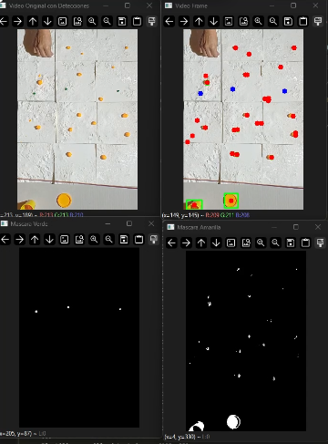
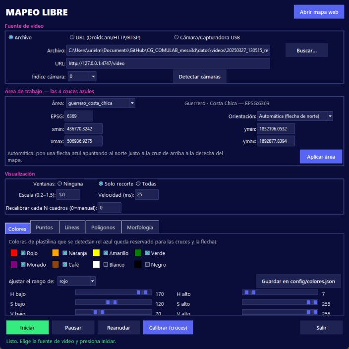
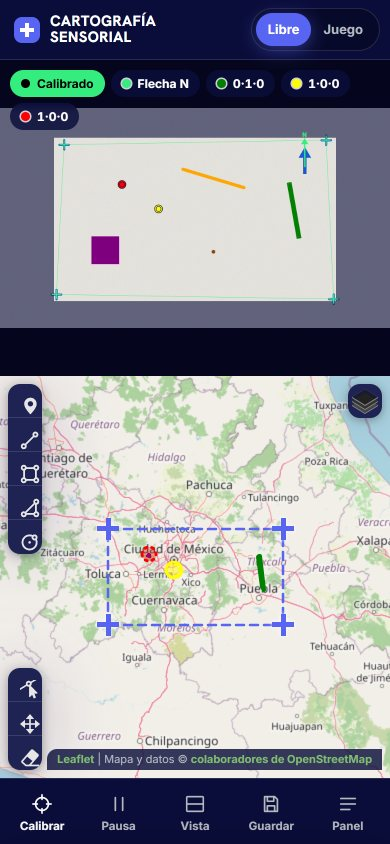
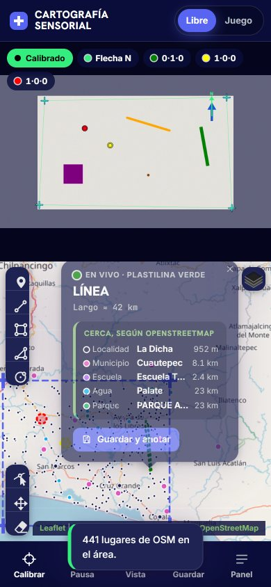
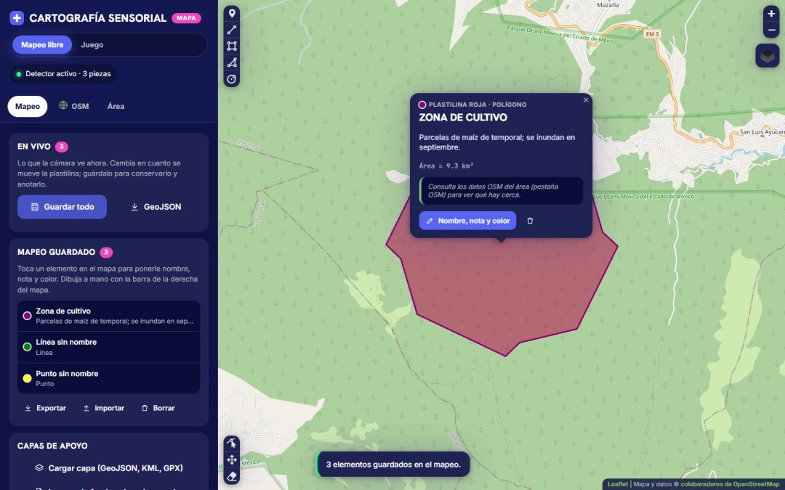
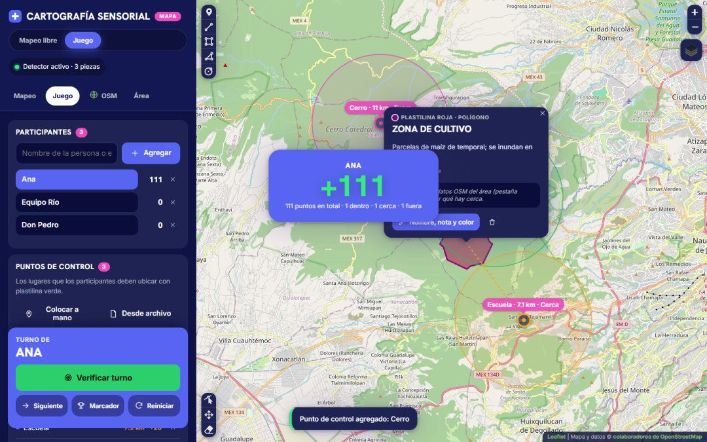

# Cartografía sensorial — Mapeo participativo con plastilina en tiempo real

<p align="center">
  <a href="https://urielmendoza.github.io/CG_COMULAB_mesa3d/web/movil/"></a>
  <a href="https://urielmendoza.github.io/CG_COMULAB_mesa3d/web/mapa/"></a>
  <a href="LICENSE"></a>
</p>

Plataforma del proyecto **COMULAB** de **CentroGeo** para mapeo participativo en comunidades. Las personas colocan **plastilina de colores** sobre un modelo de elevación 3D, un mapa impreso o una imagen satelital. Una cámara reconoce cada pieza y la dibuja al instante en un **mapa georreferenciado**. Ese mapa se enriquece con datos de **OpenStreetMap**, se anota y se exporta.



*Primera versión probada en campo: video original, detecciones clasificadas y máscaras de color. Pronto habrá videos demostrativos.*

---

## Abrir la plataforma

| | Enlace | Para qué |
|---|---|---|
| 📱 **App del celular** | **<https://urielmendoza.github.io/CG_COMULAB_mesa3d/web/movil/>** | Todo en el celular: cámara, detección y mapa. No necesita laptop. |
| 🗺️ **Mapa web** | **<https://urielmendoza.github.io/CG_COMULAB_mesa3d/web/mapa/>** | Ver, anotar y exportar mapeos; juego; datos OSM. Con la versión laptop se abre local, desde el detector. |

La app del celular se abre en Chrome (Android) o Safari (iPhone) y pide permiso para la cámara. Con **Agregar a pantalla de inicio** queda instalada como aplicación y funciona sin internet después de la primera visita.

---

## Cómo funciona

1. En las 4 esquinas del área de trabajo se colocan **cruces azules**.
2. Junto a la cruz de **arriba a la derecha** del mapa (esquina noreste) se coloca una **flecha azul apuntando al norte**. Así el sistema sabe solo cómo está orientada la cámara.
3. Se elige el área (o se escriben las coordenadas de las esquinas) y se presiona **Calibrar**. El sistema calcula una *homografía* entre las cruces de la imagen y las esquinas reales.
4. La plastilina se reconoce por su color y su forma, y aparece en el mapa en coordenadas geográficas.

### Dos modos

- **Mapeo libre.** Solo se dan las esquinas y se empieza a mapear con plastilina de varios colores. Lo que aparece en vivo se **guarda** con un toque y se **anota** con nombre, nota y color. También se puede **dibujar a mano** (puntos, líneas, polígonos, rectángulos, círculos) y editar o borrar.
- **Juego.** Dinámica genérica para cualquier territorio:
  1. Se registran los participantes (personas o equipos).
  2. Se definen **puntos de control**: a mano sobre el mapa, desde un archivo o como **reto con lugares reales de OpenStreetMap**.
  3. Los puntos quedan ocultos. Cada participante los ubica con plastilina verde y el sistema mide la distancia y asigna puntos.

### Colores de plastilina

| Color | Muestra | Uso |
|---|---|---|
| Verde `#008000` | 🟩 | **activo** (es también el color del juego) |
| Amarillo `#FFFF00` | 🟨 | **activo** |
| Rojo `#FF0000` | 🟥 | **activo** |
| Naranja `#FFA500` | 🟧 | apagado; se activa en la interfaz |
| Morado `#800080` | 🟪 | apagado; se activa en la interfaz |
| Café `#8B4513` | 🟫 | apagado; se activa en la interfaz |
| Blanco `#FFFFFF` | ⬜ | apagado: se confunde con el papel |
| Negro `#000000` | ⬛ | apagado: se confunde con las sombras |
| **Azul** | 🟦 | **reservado para las cruces y la flecha de norte** |

Por defecto solo se detectan **verde, amarillo y rojo**, los más fáciles de distinguir entre sí. Cada pieza se clasifica como **punto, línea o polígono** según su forma. Los rangos de color están en [`config/colores.json`](config/colores.json) y se calibran desde la ventana del detector (pestaña *Colores*, botón *Guardar*) o desde la app del celular (*Panel → Cámara → Colores y tamaños*).

### Dos versiones, el mismo sistema

| | Versión laptop | Versión celular |
|---|---|---|
| Qué se necesita | Laptop + cámara (celular con DroidCam, webcam o capturadora) | **Solo un celular** |
| Detección | Python + OpenCV (`escritorio/`) | OpenCV.js en el navegador (`web/movil/`) |
| Mapa | `web/mapa/`, se abre con el botón **Abrir mapa web** del detector | El mismo mapa, en la pantalla del celular |
| Instalación | `pip install -r requirements.txt` | Ninguna |

Las dos versiones usan los mismos colores, la misma clasificación, la misma georreferenciación y el mismo mapa (`config/` y `web/comun/`). Con la misma imagen dan los mismos resultados (ver [Validación](#validación)).

---

## Estructura del repositorio

```
├── config/
│   ├── georreferencia.json     Áreas predefinidas y orientaciones (Python y web)
│   └── colores.json            Colores de plastilina y sus rangos (Python y web)
├── escritorio/                 Versión laptop (Python)
│   ├── detector_libre.py       ▶ Detector de mapeo libre
│   ├── detector_juego.py       ▶ Detector para el juego
│   ├── georreferencia.py       Cruces, flecha de norte, homografía y colores (compartido)
│   ├── servidor_mapa.py        Servidor local del mapa (lo usa el botón "Abrir mapa web")
│   ├── estilo.py               Estilo visual de las ventanas
│   ├── herramientas/
│   │   ├── probar_camara.py    Prueba rápida de la cámara / DroidCam
│   │   └── descargar_osm.py    Pre-descarga los datos OSM de cada área
│   └── legacy/                 Primeras versiones (referencia histórica)
├── web/
│   ├── comun/                  Mapa, OSM, juego, paneles, respaldo y estilos (compartido)
│   │   ├── vendor/             Leaflet, Geoman, proj4 y togeojson (servidos desde el mismo sitio)
│   │   └── datos_osm/          Datos OSM pre-descargados por área
│   ├── mapa/                   ▶ Mapa web
│   └── movil/                  ▶ App del celular (cámara + detección + mapa)
├── ejemplos/geojson/           GeoJSON de sesiones anteriores para probar el mapa
├── docs/img/                   Imágenes del README
├── datos/          (local)     Videos y capas pesadas — NO se suben (ver datos/LEEME.md)
└── salidas/        (local)     Lo que escriben los detectores en tiempo real — NO se sube
```

Los videos (`*.mp4`), las capas geográficas (`*.gpkg`, `*.tif`) y las salidas en tiempo real están en `.gitignore`. Cada equipo coloca sus archivos en `datos/` según [`datos/LEEME.md`](datos/LEEME.md).

---

## Materiales

- Modelo 3D, mapa impreso o imagen satelital del área.
- **4 cruces azules** (papel, cinta o plastilina) en las esquinas, que deben coincidir con las coordenadas configuradas.
- **1 flecha azul** apuntando al norte, junto a la cruz de arriba a la derecha del mapa. Es opcional pero recomendada; debe verse alargada, con la punta más ancha, por ejemplo un triángulo sobre una barra.
- Plastilina de colores saturados (ver la tabla de colores).
- Soporte o tripié para dejar la cámara **fija, mirando hacia abajo**, con las 4 cruces a la vista.
- Luz pareja, sin sombras duras ni reflejos.

---

## Versión laptop

### Instalación

Requiere Python 3.10 o superior.

```bash
git clone https://github.com/UrielMendoza/CG_COMULAB_mesa3d.git
cd CG_COMULAB_mesa3d
pip install -r requirements.txt
```

### Conectar la cámara del celular (DroidCam)

1. Instala **DroidCam** en el celular y conecta celular y laptop a la **misma red Wi‑Fi**.
2. DroidCam muestra una URL como `http://192.168.1.66:4747/video`. Pruébala:
   ```bash
   python escritorio/herramientas/probar_camara.py http://192.168.1.66:4747/video
   ```
   Con webcam, capturadora o el cliente de DroidCam para PC, usa el índice de la cámara: `python escritorio/herramientas/probar_camara.py 1`.

### Ejecutar

```bash
python escritorio/detector_libre.py    # Mapeo libre
python escritorio/detector_juego.py    # Juego
```



1. Elige la **fuente de video**: archivo, URL (DroidCam/RTSP) o cámara USB.
2. Elige el **área** y la **orientación** (*Automática* usa la flecha de norte).
3. Presiona **Iniciar**. Cuando se vean las 4 cruces, presiona **Calibrar (cruces)**.
4. Presiona **Abrir mapa web**. El detector levanta un servidor local y abre el mapa en el navegador; el mapa se sincroniza solo con el modo y el área del detector.

**Cambiar de región en vivo:** elige otra área (o edita las coordenadas) y presiona **Aplicar área**. Las piezas se reubican al instante con la calibración que ya existe; no hace falta reiniciar ni volver a calibrar.

El detector escribe en `salidas/` los archivos `detecciones_puntos.geojson`, `detecciones_lineas.geojson`, `detecciones_poligonos.geojson` y `sesion.json`. Siempre se reescriben completos, así el mapa nunca muestra posiciones viejas.

> Para abrir solo el mapa, sin detector, usa `python escritorio/servidor_mapa.py` (o `servidor_mapa.py movil` para la app del celular en la laptop).

---

## Versión celular

Todo corre en el navegador del celular: cámara trasera, detección, calibración y mapa. El video **no se envía a ningún servidor**.

<p>
  
  
</p>

**Abrir:** <https://urielmendoza.github.io/CG_COMULAB_mesa3d/web/movil/>

1. Arriba, elige **Libre** o **Juego**.
2. **Panel → Cámara → Área de trabajo**: elige el área o escribe EPSG y esquinas. Deja la orientación en *Automática* si usas la flecha.
3. **Usar la cámara** y fija el celular sobre la mesa. También puedes usar **Probar con un video**.
4. Cuando el indicador diga **Cruces 4/4** y **Flecha N**, el botón **Calibrar** se ilumina: presiónalo.
5. La plastilina aparece en el mapa. La barra inferior tiene:
   - **Pausa**: congela las detecciones.
   - **Vista**: alterna entre cámara + mapa, solo cámara y solo mapa.
   - **Guardar**: pasa lo que está en vivo al mapeo guardado.
   - **Panel**: pestañas de cámara, mapeo, juego y OSM.

Consejos:
- **Datos móviles**: la app abre aunque la conexión sea lenta. La primera vez descarga la visión por computadora (OpenCV, ~10 MB) y muestra el avance; si un servidor no responde, prueba otro solo. Desde la segunda vez abre desde lo guardado en el celular.
- **Proyectar**: usa la función de duplicar pantalla del celular (Smart View, Chromecast, AirPlay).
- **Rendimiento**: en celulares modestos, baja la resolución de análisis (640 px) o los cuadros por segundo (5).
- **Desarrollo o uso en la laptop**: `python escritorio/servidor_mapa.py movil` abre la app en `localhost`, que tiene permiso de cámara.

> Para publicar tu propia copia (fork): **Settings → Pages → Deploy from a branch → `main` / `(root)`**. Queda en `https://TU_USUARIO.github.io/CG_COMULAB_mesa3d/web/movil/`.

---

## Orientación: flecha de norte

La homografía asocia cada cruz de la imagen con una esquina del mapa. Con la **flecha de norte** junto a la cruz noreste, el sistema resuelve solo:

- **cuál cruz es cuál**: la más cercana a la flecha es la noreste;
- **hacia dónde apunta el norte**, incluso si la cámara está girada o la imagen está en espejo.

Si no se pone flecha, se usa *Norte arriba* y se avisa. En ese caso se puede elegir la orientación a mano:

| Opción | Cuándo usarla |
|---|---|
| Automática (flecha de norte) | Recomendada |
| Norte arriba / a la derecha / abajo / a la izquierda | Sin flecha, según cómo quedó la cámara |
| Espejo (transpuesta) | Cámaras que invierten la imagen (equivale a la versión anterior del detector del juego) |

**Prueba rápida:** pon una pieza junto a la cruz de arriba a la izquierda; debe aparecer en esa esquina del mapa.

---

## El mapa (laptop y celular)



- **En vivo**: lo que la cámara ve ahora.
- **Mapeo guardado**: lo que se decide conservar. Con **Guardar todo** o **Guardar y anotar**, cada elemento recibe **nombre, nota y color**.
- **Dibujo a mano**: la barra de la derecha dibuja, mueve, edita y borra. Lo dibujado se anota igual.
- **Capas de apoyo**: GeoJSON, KML o GPX, o una **imagen de fondo** que se ajusta a las esquinas del área.
- **Exportar**: el GeoJSON incluye `nombre`, `nota`, `color`, `origen` y el **contexto OSM** de cada elemento (`osm_localidades`, `osm_municipios`, …).

### Tus datos se quedan en tu dispositivo

Todo lo que capturas (mapeo, nombres, notas, participantes, puntos de control, puntajes, ajustes de color) se guarda **solo en el navegador del dispositivo** donde lo capturaste. **No se sube a ningún servidor** y nadie más lo ve, aunque la página esté publicada en GitHub Pages; esa página solo entrega el programa.

En **Mapeo → Tus datos**:
- **Descargar respaldo** baja un archivo `.json` con todo. Sirve para guardarlo, compartirlo o pasarlo a otro equipo.
- **Cargar respaldo** lo restaura en cualquier dispositivo.

### Usar sin internet

En la app del celular (**Panel → Cámara → Usar sin internet**) y en el mapa web (**Área → Usar sin internet**) hay un botón **Descargar para usar sin internet**. No descarga nada hasta que lo presionas.

Antes de descargar pregunta si estás seguro y muestra:
- qué se guarda y cuánto ocupa cada cosa:
  - la aplicación y sus librerías, ≈ 0.9 MB;
  - OpenCV, ≈ 10 MB (solo en el celular);
  - los datos OSM del área, 0.05–1.3 MB;
- el total;
- el espacio libre disponible;
- **dónde se guarda**: en el almacenamiento interno del navegador del dispositivo (datos del sitio). No aparece en Descargas ni en la galería.

El **mapa base** no se descarga de golpe porque OpenStreetMap no lo permite. En la misma ventana eliges un límite (50, 150 o 300 MB). Cada zona que recorras en el mapa mientras tengas internet queda guardada y se ve después sin conexión. Sin internet también puedes usar una **imagen de fondo** del área.

**Borrar lo descargado** libera ese espacio. Tu mapeo, tus notas y el juego no se borran.

Para usar la plataforma **totalmente local**, sin depender de GitHub:
1. Descarga el repositorio (**Code → Download ZIP**).
2. Ejecuta `python escritorio/servidor_mapa.py`.

---

## OpenStreetMap en el centro

OpenStreetMap (OSM) es el mapa colaborativo del mundo. Además de ser el mapa base, la plataforma **consulta su base de datos** dentro del área de trabajo. Los datos OSM **solo se cargan cuando presionas «Consultar datos OSM del área»** (pestaña OSM); antes no aparecen en el mapa.

| Categoría | Qué incluye | Visible al inicio |
|---|---|---|
| Localidades | ciudades, pueblos, localidades (y caseríos en áreas chicas) | sí |
| Municipios y alcaldías | centro de cada municipio | sí |
| Cerros y volcanes | cumbres con nombre | sí |
| Parques y reservas | parques, reservas, áreas protegidas | sí |
| Ríos, lagos y presas | cuerpos de agua y ríos con nombre | sí |
| Puertos y muelles | puertos, marinas, terminales de ferry | sí |
| Colonias y barrios | colonias (y barrios en áreas chicas) | no (se activa en la leyenda) |
| Salud | hospitales, clínicas, consultorios | no |
| Escuelas | escuelas y universidades | no |

Con esos datos la plataforma ofrece:
- **Qué hay cerca de cada pieza**: localidad y municipio, más los 3 lugares más cercanos de otras categorías, con distancia.
- Un **buscador** de lugares.
- **Retos del juego** con lugares reales: localidades, cerros, naturaleza o una mezcla.

**De dónde salen los datos al consultar**, en este orden:
1. la copia ya guardada en el dispositivo;
2. los **datos incluidos con la plataforma** para las áreas predefinidas (`web/comun/datos_osm/`), que cargan al instante y sin internet;
3. solo si no hay ninguno de los dos, la consulta en vivo a los servidores públicos de OSM (Overpass), que se saturan seguido y pueden responder `504`. Para un área nueva, agrégala a `config/georreferencia.json` y ejecuta una vez:

```bash
python escritorio/herramientas/descargar_osm.py mi_area
```

En áreas personalizadas la consulta es en vivo. Cada categoría se consulta por separado y se reintenta en varios servidores; si alguna falla, las demás se cargan y aparece **Reintentar solo esas**. Lo consultado queda guardado en el dispositivo.

Datos © colaboradores de OpenStreetMap, licencia ODbL. Si algo de la comunidad falta en OSM, se puede [agregar en openstreetmap.org](https://www.openstreetmap.org/fixthemap).

## El juego



1. **Participantes**: escribe los nombres (personas o equipos) y presiona Agregar.
2. **Puntos de control**:
   - **Colocar a mano** sobre el mapa.
   - **Desde archivo**: GeoJSON, KML o CSV con columnas `nombre, lat, lon`.
   - **Reto con OpenStreetMap**: N lugares reales al azar (localidades, cerros, naturaleza o de todo un poco). También se puede usar como punto de control cualquier lugar OSM, tocándolo.

   Quedan ocultos hasta presionar **Mostrar**. Con **Exportar** se reutilizan.
3. **Radio de acierto** en km.
4. Cada participante coloca plastilina verde donde cree que está cada lugar. **Verificar turno** compara cada punto con la pieza más cercana:
   - dentro del radio: 50–150 puntos;
   - hasta el doble del radio: 10–40 puntos;
   - fuera: casi nada.
5. **Siguiente** pasa el turno y **Marcador** muestra la tabla.

---

## Georreferenciación: áreas incluidas

Las áreas están en [`config/georreferencia.json`](config/georreferencia.json). Las usan Python y la web; agrega ahí las tuyas.

El área por defecto es **Cuenca del Valle de México · Sentinel-2**.

| Área | EPSG | xmin | ymin | xmax | ymax |
|---|---|---|---|---|---|
| Guerrero · Costa Chica | 6369 | 436770.3242 | 1832196.0532 | 506936.9275 | 1892877.8394 |
| Cuenca del Valle de México · Sentinel-2 | 32614 | 409907 | 2074280 | 612270 | 2184872 |
| Cuenca del Valle de México · modelo 3D | 32614 | 416316.969 | 2079317.310 | 617400.705 | 2256323.915 |

La web reconoce sin conexión las zonas UTM 11N a 16N (WGS84: 32611–32616; ITRF2008: 6366–6371). Cualquier otro EPSG lo obtiene de epsg.io.

## Ajuste de colores (HSV)

- El tono (H) va de 0 a 179. Aproximadamente: rojo 170–7 (da la vuelta), naranja 8–21, amarillo 22–34, verde 35–85, azul 100–130 (cruces), morado 136–168.
- Si la impresión tiene zonas del mismo color que la plastilina, **sube S bajo**: la plastilina es más saturada que el papel.
- Usa las vistas de **máscara**, una por color, para ver qué se detecta.
- Naranja y café comparten tono; los separa el brillo (V). Ajusta **V bajo** del naranja y **V alto** del café según tu luz.
- Las áreas mínimas están en píxeles del cuadro analizado; ajústalas si cambias la resolución o la altura de la cámara.

## Diseño

Las interfaces (web y ventanas de escritorio) comparten un sistema visual oscuro con **colores sólidos, sin degradados**:
- fondo índigo profundo;
- botones blurple para la acción principal, verde eléctrico para la de más intención (usar la cámara, iniciar, verificar turno, descargar respaldo) y magenta para acentos;
- títulos en Hanken Grotesk 800 en mayúsculas y texto en Inter.

El mapa de OpenStreetMap se mantiene claro para que sea el protagonista.

## Validación

- **Celular vs. Python**: la detección se comparó en Chrome headless con una escena sintética de 6 colores, flecha de norte y cruces en perspectiva, en tres variantes: normal, girada 90° y en espejo. Hubo misma orientación, mismos tipos y colores, y coordenadas a < 0.11 m en las 6 combinaciones (3 variantes × 2 modos).
- **Flecha de norte**: se resolvió bien en normal, girada y en espejo; sin flecha cae en *Norte arriba*.
- **Cambio de región en vivo**: con el detector corriendo, al pasar de Guerrero a Valle de México las piezas se movieron de lat 16.9 a 19.3 sin recalibrar. Se probó en laptop y celular.
- **Flujos completos**, con cámara simulada y el detector de Python escribiendo en `salidas/`:
  - sincronización del mapa;
  - mapeo, anotación y dibujo;
  - respaldo;
  - juego con reto OSM y puntaje.

## Problemas conocidos

- Las áreas mínimas y máximas dependen de la resolución y la altura de la cámara; ajústalas en cada montaje.
- Blanco y negro vienen desactivados porque se confunden con el papel y las sombras.
- Las consultas en vivo a OSM dependen de servidores públicos que a veces se saturan. Para las áreas incluidas se usan los datos pre-descargados.
- Hasta la versión anterior, `detector_juego.py` usaba un mapeo **en espejo**. Ahora arranca en *Automática*; si tu cámara invierte la imagen, la flecha lo detecta sola.

## Créditos

Proyecto COMULAB — CentroGeo. Desarrollo: Uriel Mendoza, Luis Alejandro Rivera y colaboradores.
Mapa base y datos geográficos © colaboradores de [OpenStreetMap](https://www.openstreetmap.org/copyright).

Licencia [MIT](LICENSE).
